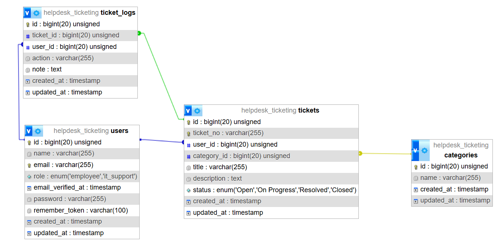

# Helpdesk Ticketing System

Aplikasi web berbasis Laravel untuk menangani keluhan dan permintaan support dari karyawan.

---

## Teknologi yang Digunakan

- PHP 8.2
- Laravel 12
- MySQL
- Tailwind CSS
- Laravel Breeze (Authentication)

---

## Fitur

### User (Employee)
- Register dan login sebagai karyawan
- Membuat tiket baru dengan nomor unik otomatis
- Melihat daftar tiket milik sendiri
- Melihat detail tiket beserta riwayat aktivitas

### IT Support
- Login sebagai IT Support
- Melihat semua tiket dari seluruh karyawan
- Filter tiket berdasarkan status, kategori, dan tanggal
- Mengubah status tiket secara bertahap (Open, On Progress, Resolved, Closed)
- Menambahkan catatan setiap kali mengupdate status tiket

### Ticket History (Log)
- Setiap perubahan pada tiket tercatat secara otomatis ke dalam activity log
- Log mencatat siapa yang melakukan aksi, aksi apa yang dilakukan, catatan, dan waktu perubahan

---

## Struktur Database

### Tabel: users
| Kolom | Tipe | Keterangan |
|-------|------|------------|
| id | bigint | Primary key |
| name | varchar | Nama user |
| email | varchar | Email user |
| role | enum | Role user: `employee` atau `it_support` |
| password | varchar | Password terenkripsi |
| created_at | timestamp | Waktu dibuat |
| updated_at | timestamp | Waktu diupdate |

### Tabel: categories
| Kolom | Tipe | Keterangan |
|-------|------|------------|
| id | bigint | Primary key |
| name | varchar | Nama kategori |
| created_at | timestamp | Waktu dibuat |
| updated_at | timestamp | Waktu diupdate |

### Tabel: tickets
| Kolom | Tipe | Keterangan |
|-------|------|------------|
| id | bigint | Primary key |
| ticket_no | varchar | Nomor tiket unik |
| user_id | bigint | Foreign key ke tabel users |
| category_id | bigint | Foreign key ke tabel categories |
| title | varchar | Judul tiket |
| description | text | Deskripsi masalah |
| status | enum | Status: `Open`, `On Progress`, `Resolved`, `Closed` |
| created_at | timestamp | Waktu dibuat |
| updated_at | timestamp | Waktu diupdate |

### Tabel: ticket_logs
| Kolom | Tipe | Keterangan |
|-------|------|------------|
| id | bigint | Primary key |
| ticket_id | bigint | Foreign key ke tabel tickets |
| user_id | bigint | Foreign key ke tabel users |
| action | varchar | Aksi yang dilakukan |
| note | text | Catatan tambahan (opsional) |
| created_at | timestamp | Waktu dibuat |
| updated_at | timestamp | Waktu diupdate |

## Diagram Schema Database


*Relationship Table diambil dari tab 'designer' di phpMyAdmin*

- **users ke tickets:** One to many. Satu user bisa punya banyak tiket. `user_id` di tabel `tickets` menyimpan id dari user yang membuat tiket tersebut. Setiap tiket wajib dimiliki oleh seorang user.
- **categories ke tickets:** One to many. Satu kategori bisa punya banyak tiket. `category_id` di tabel `tickets` menyimpan id dari kategori yang dipilih saat membuat tiket.
- **tickets ke ticket_logs:** One to many. Satu tiket bisa punya banyak log. `ticket_id` di tabel `ticket_logs` menyimpan id dari tiket yang sedang diupdate.
- **users ke ticket_logs:** One to many. Satu user bisa punya banyak log. `user_id` di tabel `ticket_logs` menyimpan id dari user yang melakukan aksi tersebut, sehingga kita tahu siapa yang melakukan update pada tiket.

## Cara Instalasi

### Prasyarat
- PHP >= 8.2
- Composer
- Node.js & NPM
- MySQL

### Langkah Instalasi

1. Clone repository ini
```bash
git clone https://github.com/Mikhaelsh/helpdesk-ticketing.git
cd helpdesk-ticketing
```

2. Install dependencies PHP
```bash
composer install
```

3. Install dependencies Node.js
```bash
npm install
```

4. Salin file environment
```bash
cp .env.example .env
```

5. Generate application key
```bash
php artisan key:generate
```

6. Konfigurasi database di file `.env`
```env
DB_CONNECTION=mysql
DB_HOST=127.0.0.1
DB_PORT=3306
DB_DATABASE=helpdesk_ticketing
DB_USERNAME=root
DB_PASSWORD=your_password
```

7. Buat database `helpdesk_ticketing` di MySQL

8. Jalankan migration dan seeder
```bash
php artisan migrate --seed
```

9. Build asset frontend
```bash
npm run build
```

10. Jalankan aplikasi
```bash
php artisan serve
```

Aplikasi dapat diakses di `http://127.0.0.1:8000`

---

## Akun Default (Seeder)

> Akun di bawah ini dibuat otomatis oleh seeder. Sesuaikan dengan data seeder yang kamu gunakan.

| Role | Email | Password |
|------|-------|----------|
| Employee | bambang@gmail.com | password |
| IT Support | budi@gmail.com | password |

---

## Alur Status Tiket

```
Open → On Progress → Resolved → Closed
```

Hanya IT Support yang dapat mengubah status tiket.

---

## Struktur Folder Penting

```
app/
├── Http/
│   ├── Controllers/
│   │   ├── TicketController.php         # Controller untuk Employee
│   │   └── IT/
│   │       └── TicketController.php     # Controller untuk IT Support
│   └── Middleware/
│       └── RoleMiddleware.php           # Middleware role-based access
├── Models/
│   ├── User.php
│   ├── Ticket.php
│   ├── Category.php
│   └── TicketLog.php
database/
├── migrations/                          # Semua migration file
├── seeders/
│   ├── UserSeeder.php
│   └── CategorySeeder.php
resources/views/
├── tickets/                             # Views untuk Employee
├── it/tickets/                          # Views untuk IT Support
└── components/
    └── status-badge.blade.php           # Komponen badge status
```
